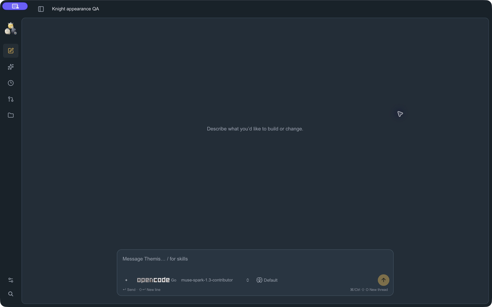

# Desktop appearance

ThemisCode keeps its existing workspace and composer. A permanent icon rail contains Plugins, Automations, Review queue, Settings, Help and Search, each with a tooltip. The expandable dock contains the shimmering Themis wordmark, New chat, projects and their threads. The top toggle and Cmd/Ctrl+B collapse only that dock; hovering never expands it. Knight artwork is removed from the interface; native icons and the favicon remain.

All new projects are created under the fixed `~/ThemisOS/Projects` root. The default **Themis** project remains first in the sidebar at `~/ThemisOS/Projects/Themis`, without a lock icon. All project display names, including Themis, can be changed without moving their folders or histories. Settings shows only the shared projects root. Settings and creation dialogs offer no location override.

Appearance is dark only. Older Light/System settings load as Dark. Settings offer 17 coordinated presets, including GitHub Dark and GitHub Dimmed, and 12 locally resolved font choices: System, Arial, Georgia, Mono, Rounded, Avenir, Helvetica, Verdana, Trebuchet, Palatino, Charter and Menlo. Font fallbacks apply where a family is unavailable. Code stays monospace. Size ranges from 12 to 22px.

Themes, fonts and sizes preview throughout the interface before saving. **Apply** persists the draft through the shared server; **Revert**, leaving Settings or a failed write restores the saved appearance. Shared action buttons use unboxed text or icons, and settings labels stay compact.

Overflowing project and thread titles make one leftward pass on hover or keyboard focus, retaining the full accessible title. Reduced-motion mode wraps titles and disables shimmer/motion.

Sidebar SVG paths use Lucide icons; see `docs/lucide-icons-LICENSE`. Native icon generation remains `swift scripts/generate-icon.swift`.

Selected threads shimmer without a colored side stripe. Internal boundaries use continuous layers: a lighter utility/header frame, dark project sidebar and darker canvas. Every palette preserves this brightness order without bright outlines or frame gaps. Appearance shows Frame · Sidebar · Canvas swatches and a live surface preview. Thread editing changes only its name; the composer controls the next model. Completed responses retain the model captured for their run. Older responses without metadata say “Model not recorded.”

Product rules: [UI rules](ui-rules.md).

Current verification: [UI polish checks](ui-polish-verification.md).

## Historical verification

The dated checks below describe earlier builds, including appearance modes and artwork that have since been removed.

## Local verification (2026-10-01)

- `npm --prefix web test`: 178 tests passed in 22 files, including collapse/navigation, palette/font persistence, contrast and existing composer Enter/IME behavior.
- `npm --prefix web run lint` and `npm --prefix web run build`: passed. Build retains the existing large-chunk warning.
- `cargo fmt --all -- --check` and `cargo clippy --workspace --all-targets -- -D warnings`: passed.
- `cargo test -p themis-desktop settings:: --lib`: 8 passed, 75 filtered.
- `cargo test -p themis-desktop --test server_cli_e2e appearance_preferences_roundtrip_through_server_and_cli`: 1 passed, 8 filtered. Checks persisted values and rejects unknown fonts without overwriting saved preferences.
- `python3 -m unittest quality_dashboard.test_dashboard`: 13 passed; `ruff check quality_dashboard`: passed.
- `swift scripts/generate-icon.swift`: passed; PNG master is 1024px RGBA, ICO contains a 256px PNG and ICNS includes the macOS sizes.
- Isolated native QA app (`ai.themis.designqa`, Vite frontend) verified expanded/collapsed navigation, saved Light/Dark appearance, palette changes, project creation and retained composer draft/model/effort/send controls. No provider request was sent. Native Serif/22px rendering and saving also passed; drag/window-control interaction remains unverified; production installation was not replaced.

The refreshed dashboard reports mean cyclomatic complexity 2.11, cognitive complexity 1.55 and maintainability 73.2 across 83 app source files. Touched settings/sidebar/app modules were reviewed; no before/after baseline was captured. The existing LCOV report shows 83.1% Rust coverage, but was not regenerated for this change and is not fresh coverage evidence.

Native QA screenshot (synthetic project and unsent draft):

## Combined plugin integration verification

The plugin branch is integrated with the Framed rail. The inline skill editor uses the existing composer surface and controls. Shift+Enter keeps its newline behavior; empty skill results do not trap Tab or Enter. Marketplace updates refresh an existing plugin's source, and imported Unix executable resources retain owner-only execution after materialization.

Fresh combined checks: 225 Rust tests passed (2 ignored and the existing named Keychain exclusion), 183 web tests passed, web lint/build and workspace Clippy passed, and all 13 dashboard tests/Ruff passed. The shared-server CLI plugin CRUD and appearance persistence journeys both pass. AST averages after including plugin modules: cyclomatic 2.46, cognitive 2.21, maintainability 73.8 across 94 files; the broader plugin code increases complexity compared with the redesign-only scope. Remote marketplace refreshing is source-verified with local-fixture update coverage; no remote marketplace installation or live provider request was used as acceptance evidence.

Combined native QA also verified local plugin creation, /create autocomplete, inserting a stable skill chip, plain-text paste and Shift+Enter multiline drafting. The Plugins refresh clears transient load errors after a successful reload. IME is covered by automated tests; native IME and window dragging remain unverified.

Hover expansion and its Appearance control are removed. The compact rail remains visible until explicitly expanded; a regression checks pointer entry with old hover-enabled settings, navigation from the rail, and reopening with the top toggle. All 183 web tests, lint/build and 13 dashboard tests/Ruff passed after this correction.

## Knight companion

The permanent rail's knight icon opens character selection (Honey, Pearl, Ink) and the Companion checkbox. These use the original transparent SVG characters. The rail icon stays available while hidden and reflects the selected character. Variant, visibility and normalized canvas position are small local UI preferences, independent of project roots or appearance templates.

The floating knight has no container. Dragging snaps it to the nearest canvas edge; arrow keys move it in either direction. Its area excludes the composer. It follows the selected conversation's work/completion/attention state and briefly reacts to a click. Reduced motion disables SVG animation and gaze movement. The startup screen uses the same selected knight and reports actual initialization stages rather than a simulated timer.
