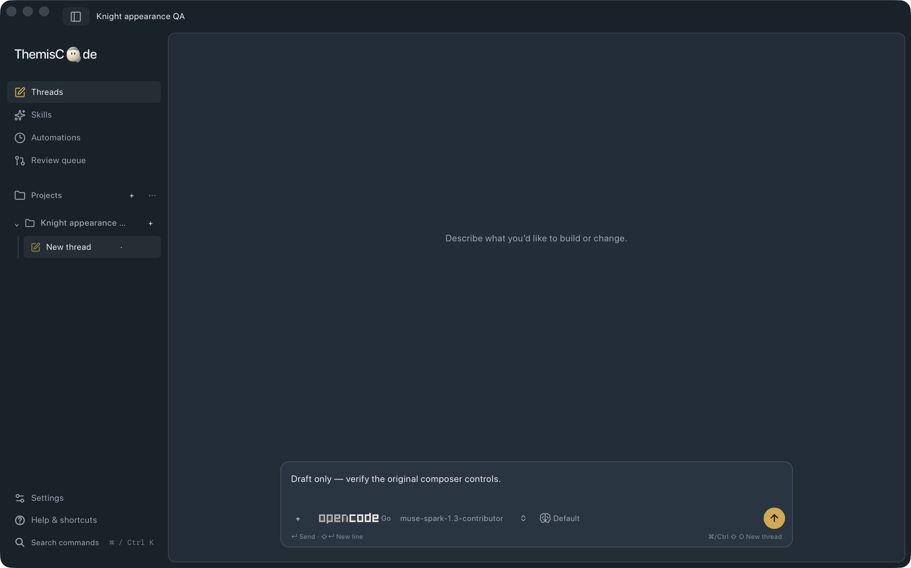

# Desktop appearance

ThemisCode uses a framed sidebar rail. Collapsing the sidebar keeps its app icon and navigation buttons visible; the top chrome toggle and Cmd/Ctrl+B reopen it. The existing delayed edge-hover preference still applies.

Appearance settings save through the shared desktop server: System/Light/Dark, five color palettes, five font families, and text sizes from 12 to 22px. Code retains its monospace font. Existing settings files default the new palette and font fields to System. The composer retains its layout and controls with fewer nested control borders and theme-aware colors.

Sidebar icons use the same Lucide SVG paths as the approved visualization (square pen, sparkles, clock, pull request, folder, settings sliders and panel toggle), shared by the expanded sidebar and compact rail. License: `docs/lucide-icons-LICENSE`.

The wordmark uses the pearl blob knight; the app icon groups honey, pearl, and ink knights in a triangle. Animated SVG artwork respects reduced motion. The native icon master is `crates/desktop/icons/icon.svg`, rasterized to `icon-source.png` at 1024px. Run `swift scripts/generate-icon.swift` from the repository root to regenerate PNG, ICNS, and ICO assets.

## Local verification (2026-10-01)

- `npm --prefix web test`: 178 tests passed in 22 files, including collapse/hover, palette/font persistence, contrast and existing composer Enter/IME behavior.
- `npm --prefix web run lint` and `npm --prefix web run build`: passed. Build retains the existing large-chunk warning.
- `cargo fmt --all -- --check` and `cargo clippy --workspace --all-targets -- -D warnings`: passed.
- `cargo test -p themis-desktop settings:: --lib`: 8 passed, 75 filtered.
- `cargo test -p themis-desktop --test server_cli_e2e appearance_preferences_roundtrip_through_server_and_cli`: 1 passed, 8 filtered. Checks persisted values and rejects unknown fonts without overwriting saved preferences.
- `python3 -m unittest quality_dashboard.test_dashboard`: 13 passed; `ruff check quality_dashboard`: passed.
- `swift scripts/generate-icon.swift`: passed; PNG master is 1024px RGBA, ICO contains a 256px PNG and ICNS includes the macOS sizes.
- Isolated native QA app (`ai.themis.designqa`, Vite frontend) verified expanded/collapsed navigation, saved Light/Dark appearance, palette changes, project creation and retained composer draft/model/effort/send controls. No provider request was sent. Native font/large-size and drag/window-control interaction remain unverified; production installation was not replaced.

The refreshed dashboard reports mean cyclomatic complexity 2.11, cognitive complexity 1.55 and maintainability 73.2 across 83 app source files. Touched settings/sidebar/app modules were reviewed; no before/after baseline was captured. The existing LCOV report shows 83.1% Rust coverage, but was not regenerated for this change and is not fresh coverage evidence.

Native QA screenshot (synthetic project and unsent draft):

## Combined plugin integration verification

The plugin branch is integrated with the Framed rail. The inline skill editor uses the existing composer surface and controls. Shift+Enter keeps its newline behavior; empty skill results do not trap Tab or Enter. Marketplace updates refresh an existing plugin's source, and imported Unix executable resources retain owner-only execution after materialization.

Fresh combined checks: 225 Rust tests passed (2 ignored and the existing named Keychain exclusion), 182 web tests passed, web lint/build and workspace Clippy passed, and all 13 dashboard tests/Ruff passed. The shared-server CLI plugin CRUD and appearance persistence journeys both pass. AST averages after including plugin modules: cyclomatic 2.46, cognitive 2.19, maintainability 73.8 across 94 files; the broader plugin code increases complexity compared with the redesign-only scope. Remote marketplace refreshing is source-verified with local-fixture update coverage; no remote marketplace installation or live provider request was used as acceptance evidence.
