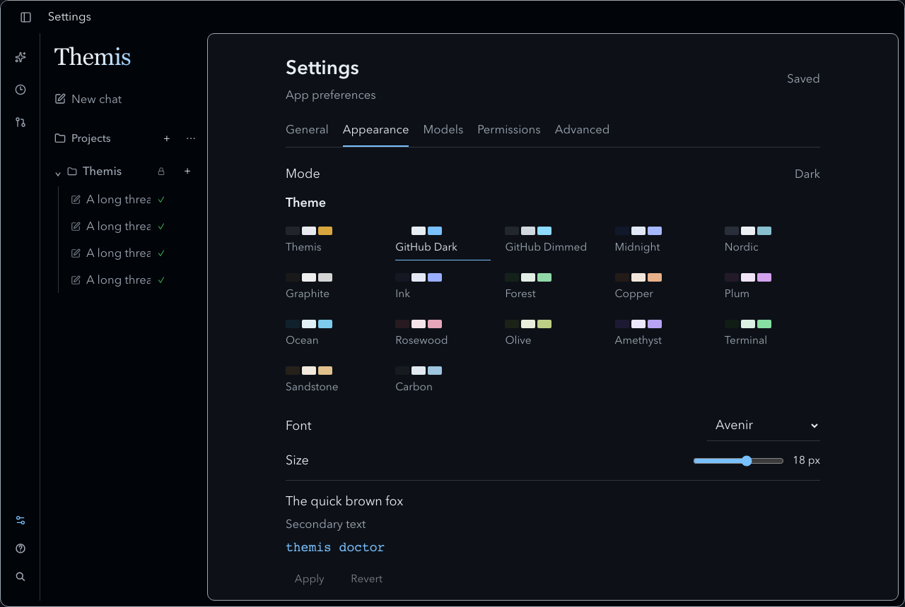

# UI polish verification — 2026-10-05

Targeted changes preserve the workspace/composer structure: permanent utility rail, expandable chat/project dock, pinned managed Themis project, dark-only appearance, 17 presets, 12 local font choices, preview/Apply/Revert, unboxed action buttons and full moving titles. Knight artwork remains only in native icons/favicon.

## Automated checks

Commands run from the repository root unless noted.

| Command | Result |
| --- | --- |
| `cargo fmt --all -- --check` | Passed |
| `cargo clippy --workspace --all-targets -- -D warnings` | Passed |
| `cargo test --workspace -- --skip entered_keys_survive_new_store_and_can_be_forgotten` | 228 passed, 2 ignored, 1 named Keychain test filtered |
| `cargo llvm-cov --workspace --lcov --output-path coverage/lcov.info -- --skip entered_keys_survive_new_store_and_can_be_forgotten` | 228 passed, 1 live-provider test ignored, 1 Keychain test filtered; 83.5% Rust line coverage (11,278 / 13,513); doctests excluded by coverage runner |
| `npm --prefix web test` | 191 passed across 23 files |
| `npm --prefix web run lint` | Passed |
| `npm --prefix web run build` | Passed; existing large-chunk warning |
| `python3 -m unittest quality_dashboard.test_dashboard` | 13 passed, dashboard tooling scope |
| `ruff check quality_dashboard` | Passed |
| `cargo build --release -p themis-desktop` | Passed |
| `npx -y @tauri-apps/cli@2 build --bundles app --config '{"build":{"beforeBuildCommand":""}}'` in `crates/desktop` | Passed, using the freshly built frontend |

The 11 shared-server CLI E2E cases are included in the Rust total. The new fixed-workspace case checks simultaneous startup, legacy Light migration, rejection of root changes and creation overrides, display-name renaming without moving files or thread histories, a real Git repository/thread, retained files and restart persistence. Every allowed palette/font is also saved and reloaded. Tests use isolated stores and synthetic credentials; the known macOS synthetic-Keychain test remains explicitly excluded. The live-provider case and documentation example remain ignored in the ordinary workspace suite.

Frontend regression checks cover rail/dock separation, a single review-queue entry, tooltip labels, dark behavior on a light OS preference, fixed-workspace restoration, unsaved preview, Revert, successful Apply, leaving Settings and failed-write rollback. Contrast tests check all preset text/secondary/accent colors against their four dark surfaces.

## Browser journey

Chromium ran the current Vite app at 1280×860 against an isolated actual app server via `themis call` and a test Tauri bridge. Event registration and credential availability/catalog were stubbed; no inference request was sent. All 17 presets and 12 font options previewed. Apply saved GitHub Dark/Avenir/18px through the server; reload restored them. Revert left persisted settings unchanged. This browser bridge used the earlier isolated QA server and its temporary root; fixed-root enforcement is covered by the freshly built CLI E2E suite and final native check.

The utility rail stayed 56px when collapsed and did not expand on hover. The interface contained no knight image. A real CLI-created/renamed thread displayed its full accessible topic; the corrected motion starts at 0px and sampled translation decreased from −5.2px to −22.4px, confirming right-to-left motion with the beginning readable first. Reduced-motion wrapped its title. The final browser check also confirmed the 1px shell boundary, selected-title shimmer with no side stripe, a name-only Edit thread dialog and restored model captions from two synthetic history events. No browser page errors remained after event cleanup. Model-history fixtures validate rendering; actual persisted metadata is separately checked by the backend event/store tests.

## Native journey

The rebuilt `target/release/bundle/macos/ThemisCode.app` was launched after confirming no active runs and restarting its older shared server. The initial native accessibility and screenshot checks confirmed the then-protected app-data root, all 17 presets and 12 font menu choices, GitHub Dark/Avenir and size preview, Revert restoring Ocean/System/13px, and collapse/reopen retaining the icon rail. Original saved appearance preferences were retained. No prompt was submitted. A warning for an already missing historical QA project was shown during recent-project restoration; existing accessible projects reopened.

The final rebuilt native app was relaunched with its updated shared server. General settings showed both protected roots under `~/ThemisOS/Projects`, without a chooser. The default project had no rename action, while the other project did. Edit thread contained Name, Cancel and Save only. Restored historical replies showed “Model not recorded”; no historical model was guessed. Screenshot checks confirmed clear shell/main boundaries and selected-title shimmer without a colored side stripe. The empty preliminary managed project was removed from recents; its directory was retained. The app remains open on the existing conversation.

Native window dragging and a live inference request were not part of this verification. The shared server started without an available OpenCode Go key; credentials were not edited.

## Code health

The live dashboard was refreshed at `http://127.0.0.1:4178/api/metrics`. The analyzer is rust-code-analysis 0.0.25. Source/AST scope includes inline Rust tests; dashboard tooling is separate. Comparison with an archived `main` snapshot:

| Scope | Cyclomatic before → after | Cognitive before → after | Maintainability before → after |
| --- | --- | --- | --- |
| Overall product | 2.46 → 2.44 | 2.21 → 2.18 | 73.8 → 73.7 |
| Settings UI | 1.93 → 2.09 | 1.23 → 1.40 | 82.0 → 81.2 |
| Sidebar UI | 2.52 → 2.59 | 2.49 → 2.63 | 81.9 → 81.7 |
| Settings backend | 3.00 → 2.80 | 2.29 → 2.04 | 66.7 → 64.9 |
| Project backend | 2.31 → 2.41 | 1.27 → 1.13 | 75.4 → 72.7 |

Small local metric regressions accompany explicit preview/error handling and workspace protection; response rendering averages cyclomatic 3.94, cognitive 4.80 and maintainability 66.5, while run dispatch averages 3.00, 3.38 and 80.6; no score-only refactor was made. New Appearance UI, appearance tokens and moving-title code have average cyclomatic complexity 1.24, 1.00 and 1.60 respectively. Fresh Rust coverage is available; frontend line coverage is unavailable. The earlier 83.4% report was stale and is not a controlled coverage baseline for this patch. Build chunk-size and Vitest configuration-deprecation warnings remain.
