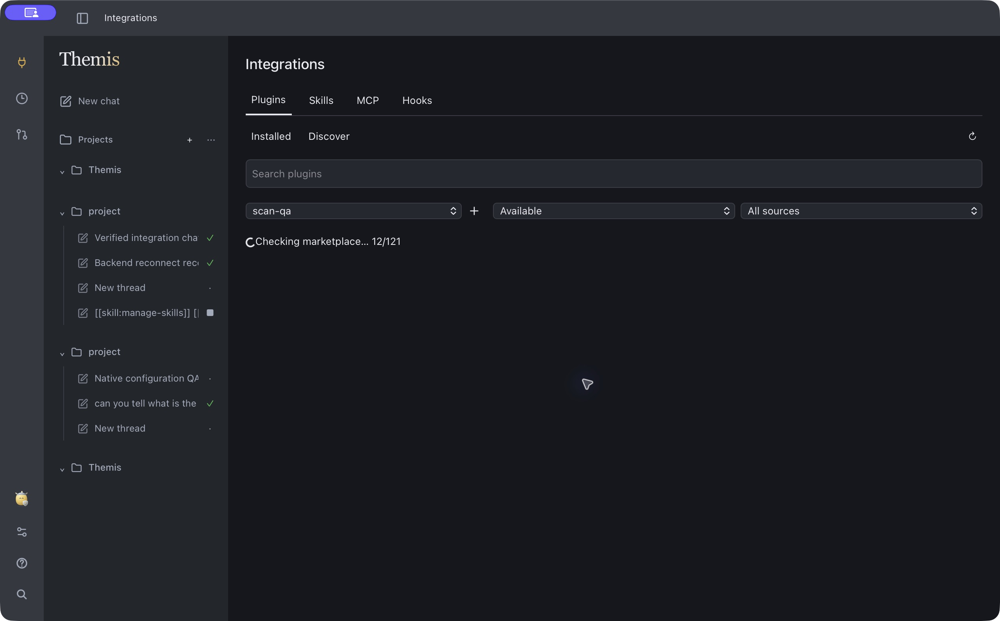
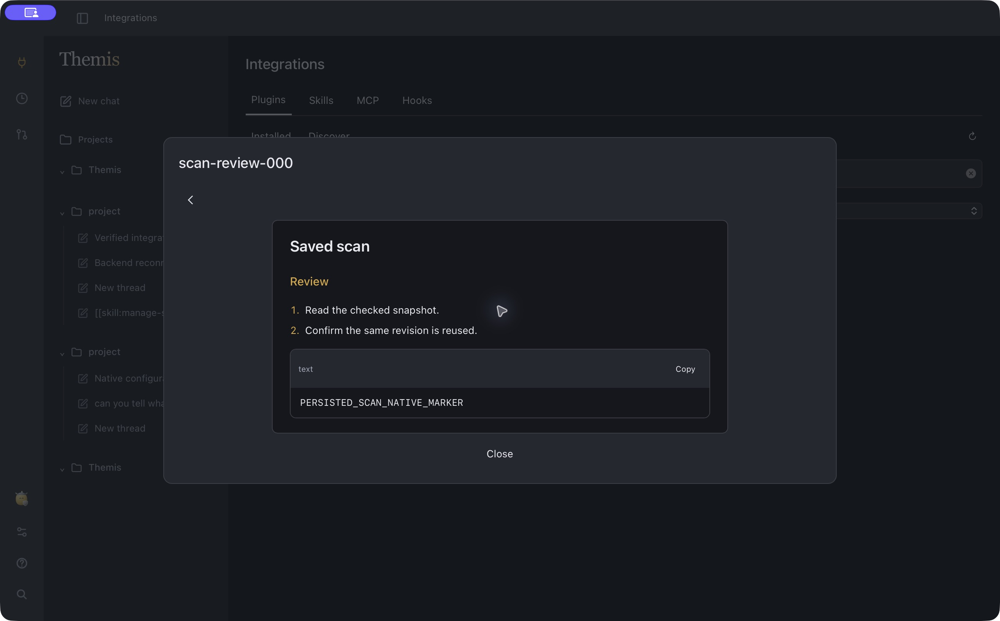
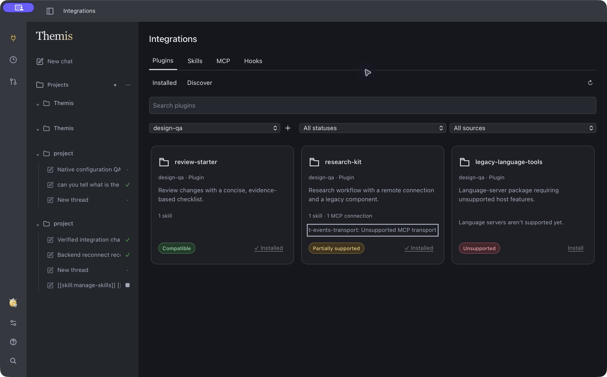

# Product review implementation — 8–9 October 2026

This follow-up implements the agreed audit fixes and integration browsing changes on `codex/full-dump-attachments`. It is local source, automated-test, and macOS native evidence. It is not a catalog-wide certification or a release deployment.

## Outcomes

| Area | Change and evidence |
| --- | --- |
| Integration browsing | Responsive discovery tiles, grouped marketplace/status/source filters, colored compatibility labels, persisted backend compatibility scans, direct global installation, pending spinner, and persistent Installed state. A whole marketplace is checked before its tiles become usable; preview and install reuse the saved snapshot. |
| Quiet details | Plugin View contains only bundled skills and View actions, with a concise empty state when there are none. Full Markdown opens separately and returns to the skill list. Partial-install decisions retain the relevant limitations. |
| Compatibility | Empty/unsupported-only imports fail instead of creating a misleading installed package. Supported components of partial packages require an explicit installation decision. Unsupported packages remain accessible through status filters. |
| Global availability | New catalog installations, chat management tools and creator guidance use global scope. Existing project packages retain their scope. No second registry was introduced. |
| Chat integrations | Native `/manage-skills`, `/manage-plugins`, `/manage-mcp`, and `/manage-hooks` journeys created synthetic global capabilities through actual shared management tools. A later `/` skill reference and `@` plugin reference loaded the real skill bodies; a loopback MCP tool was called through the runtime and its result reached the model. |
| Skill discovery | Fixed materialized catalog paths so `read_file` can read the advertised skill files. Resolve the catalog in one batch and reuse discovery within each resolution, preserving current activation and saved revisions. No latency benchmark was performed. |
| Recovery | Forward reconnect/event-gap signals, reload durable completed histories and pending approvals, preserve active stream text, and retry reconciliation. Native app restart restored a pending approval; a separate backend restart updated a changed chat title without app reload. |
| Editor reliability | Fixed the WebKit stale selection offset that caused a blank screen after sending skill chips. Regression plus native repeated management/use journeys passed. Labels remain visible while the same project's skill inventory refreshes. |
| Keyboard and forms | Automation Instructions participates in autofocus and keyboard wrapping. Native Shift+Tab reached Save and Tab returned to Instructions. Destination, timezone, and paused/enabled state are visible outside Advanced. |
| UI polish | Removed the duplicate composer new-thread button, clarified run-scoped approvals, reduced provider-logo emphasis, and gave sidebar titles more room. |
| Companion | Mood changes no longer call native show repeatedly. Exercised chat run/approval transitions stayed usable in the main window. Startup/window selection through Computer remains ambiguous; see limits. |
| Design contract | Root `DESIGN.md` records philosophy, copy/container/button rules, current token colors, compatibility colors, accessibility, and the review gate. `docs/ui-rules.md` links to it. |
| Dashboard | Declaration-only modules now show maintainability N/A rather than a misleading zero. Dashboard self-tests pass and the refreshed Code health view was inspected through Computer. |

## Native end-to-end evidence

The isolated app is `/tmp/themis-configuration-qa/ThemisConfigurationQA.app`, using app data under `ai.themis.configuration.qa`. Production installation and other running servers were not replaced. Old native PIDs were stopped before copying the rebuilt executable; source/copy hashes were compared before ad-hoc signing and the new native window was inspected. Final source executable SHA-256: `e0fc70863c4e4f0a7038091b37aa12fe644a4e8e41e9a0c3d46ec5b9e606f2b7`; signed QA copy: `f531ea3dd115070cd25a68196de32682f3f712c1d730ba3f7bfea98d169ddf29`.

The synthetic host uses the current desktop library, memory-only dummy credentials, a loopback model, and no automation scheduler. The model is scripted: this verifies transport, management, permissions, file reads, MCP execution, and UI behavior, not model reasoning or external account authentication.

1. **Create:** selected all four `/manage-*` commands in the native composer. Four actual `read_file` calls loaded the manager instructions; subsequent calls created a personal skill, plugin, MCP definition, and disabled hook globally. Eight successful tool results returned through chat.
2. **Approval recovery:** restarted the native app while the backend was awaiting a read approval. The approval reappeared, the run remained active, and allowing it continued the same run.
3. **Enable/test:** explicitly enabled the synthetic loopback MCP, initialized it and listed its `lookup` tool. A harmless hook test returned `NATIVE_HOOK_VERIFIED`; the saved hook remained disabled. Three successful results returned through chat.
4. **Use:** selected `@qa-final-bundle` and `/g--qa-final-skill--review`. The runtime read both personal and bundled instructions and called the real loopback MCP tool after approvals. The model received `PERSONAL_SKILL_CHAT_MARKER`, `BUNDLED_SKILL_CHAT_MARKER`, and `NATIVE_MCP_LOOKUP_VERIFIED`, with no tool errors.
5. **Install:** installed the compatible `review-starter` fixture directly from its tile. Installed the supported parts of `research-kit` after its partial-support decision. Both appeared globally, retained Installed labels, and were visible from another project through the CLI. The imported MCP component remained disabled. An existing local research-kit was preserved.
6. **Tile checks:** after a fresh native launch, selected the fixture marketplace without opening any plugin. Compatible and Partially supported appeared automatically; All statuses exposed the already-checked Unsupported fixture with disabled Install. This first pass preceded the full-marketplace persistent scanner; final scanner evidence is recorded below.
7. **Details:** opened research-kit and observed only its skill and View/Close controls. View rendered the complete Markdown and Back returned to the list. The final action is an ordinary button, not a misleading toggle. The inset reader uses differentiated headings, real list markers, inline code and fenced blocks. Keyboard focus moved a long tile reason from its beginning through the final unsupported-transport explanation; reduced-motion behavior is covered by CSS but not an OS setting change.
8. **Filters:** exercised Personal/Public installed filtering, status filtering, unsupported visibility, and retained installation state. The final Check failed filter showed only the missing-source fixture with a concise retry reason and disabled Install. Installed → Discover retained the selected marketplace.
9. **Transport recovery:** kept the native app running, stopped the synthetic backend, changed a saved synthetic chat title before the replacement backend accepted connections, and observed `Backend reconnect recovered` in the sidebar without reloading the app.
10. **Automation:** reopened the paused fixture, verified the visible destination/timezone/paused summary, matched Repeat/Time control heights, Instructions autofocus, and keyboard wrap. Cancel/Escape preserved the fixture.

11. **Persistent full scan:** added the isolated 121-entry scan-qa marketplace through the rebuilt native UI while the official marketplace was scanning. Observed `Checking marketplace… 12/121` and no installable tiles until all 121 entries completed. The intentionally missing source remained visible with Check failed and disabled Install.
12. **Snapshot restart and install:** stopped and replaced the isolated backend, changed the synthetic source Markdown, then opened scan-review-000 for the first time. Native View still displayed `PERSISTED_SCAN_NATIVE_MARKER`; the saved scan revision was unchanged. Tile Install stored that exact reviewed body globally, despite the source now containing a different marker.

After verification, the isolated native app, synthetic backend, and loopback mock services were stopped. QA fixtures were retained; the temporary MCP was disabled.

Earlier synthetic attempts exposed the skill-path and WebKit selection defects and were stopped. One initial mock attempt used an unsupported model protocol; the successful acceptance journeys used the loopback `test` model. Failed exploratory chats remain separate from the final verified chat.

## Native captures

## Automated checks

| Command | Result |
| --- | --- |
| `cargo fmt --all -- --check` | Passed |
| `cargo test --workspace -- --skip entered_keys_survive_new_store_and_can_be_forgotten --test-threads=1` | 337 passed, 3 ignored, 1 filtered |
| `cargo clippy --workspace --all-targets -- -D warnings` | Passed |
| `npm --prefix web test` | 301 passed in 29 files using the normal configured command |
| `npm --prefix web test -- --run src/screens/Plugins.test.tsx` | 32 passed, including late scan/preview response races and failed-status filtering |
| `npm --prefix web run lint` | Passed |
| `npm --prefix web run build` | Passed; existing large-chunk warning remains |
| `ruff check quality_dashboard` | Passed |
| `python3 -m unittest quality_dashboard.test_dashboard` | 14 passed |
| `TAURI_CONFIG='{"identifier":"ai.themis.configuration.qa","productName":"ThemisConfigurationQA"}' cargo build -p themis-desktop --bin themis-desktop --features tauri/custom-protocol` | Passed |

The Rust run includes shared-server/CLI import, plugin CRUD, prompt catalog, MCP/hooks, policy, approval, persistence, and runtime journeys. The named Keychain test was excluded and is not counted as passing. Ignored cases are the external public-import acceptance test, live-provider test, and illustrative doctest.

The frontend runner bounds concurrent jsdom workers at two; the attachment journey awaits its asynchronous transitions. No timeout increase was needed. Earlier Rust runs under concurrent build load hit timing-sensitive compaction cases; the complete final sequential run passed. Invalid import fixtures caught during testing were corrected to include real capabilities and required fields. A TypeScript error in deferred-response test fixtures was corrected before the final build. A full scan run caught a completion-boundary lock race (306 passes before the CLI failure); it was corrected with waiting readers and a 16-concurrent-preview regression. One parallel focused CLI test run stalled under concurrent build load and was stopped; the corrected local-scope fixture and all four plugin CLI tests passed with `--test-threads=1`.

## Measured code health

AST metrics use rust-code-analysis 0.0.25. Inline Rust test modules remain in source LOC/AST; standalone tests and dashboard tooling are excluded from AST averages. Inventory counts and executed parameterized tests are different measures.

| Metric | Original review | Follow-up snapshot |
| --- | ---: | ---: |
| Product source files | 183 | 187 |
| Total source/test LOC | 47,666 | 48,976 |
| Mean file cyclomatic complexity | 2.52 | 2.56 |
| Mean file cognitive complexity | 2.24 | 2.26 |
| Mean callable maintainability | 73.3 | 73.4 |

The final snapshot was refreshed at 22:16:57 UTC on 8 October and includes the backend scan implementation and final UI changes. The small complexity increase reflects additional state/recovery behavior; the tiny MI difference is not evidence of a meaningful maintainability gain. No threshold is imposed.

Touched module snapshot (cyclomatic / cognitive / maintainability): Plugins.tsx **2.98 / 3.24 / 80.8**; scans.rs **4.43 / 1.84 / 66.5**; desktop state/plugins.rs **9.62 / 4.36 / 74.3**; store.tsx **2.29 / 3.72 / 73.3**; PromptInput.tsx **3.91 / 5.94 / 74.6**; core plugins.rs **2.96 / 2.27 / 74.9**; desktop state/threads.rs **2.08 / 0.90 / 78.7**. Dense integration JSX, prompt selection logic, and reconciliation remain reasonable review targets. Existing large runtime/provider/tool modules remain; no speculative architectural rewrite was introduced.

Available Rust LCOV is **88.2% (18,575/21,060 lines)**, timestamp 8 October 2026 21:17:35 local. It was not regenerated for these changes and is not fresh coverage evidence. Frontend line coverage remains unavailable.

## Reviewer scores

These are judgement scores, not measured usability results or benchmarks. Scale: 5 = usable with substantial gaps; 8 = strong with specific remaining gaps; 10 = comprehensive evidence and no material identified gaps.

| Area | Before | After | Basis |
| --- | ---: | ---: | --- |
| Architecture | 8 | 8 | Shared server, owning layers and revisioned stores retained |
| Maintainability | 7 | 7.5 | Repeated catalog work reduced; recovery/UI complexity still deserves care |
| Visual UI | 8 | 8 | Integrations are clearer; broad visual quality was already stronger elsewhere |
| Keyboard/accessibility | 6 | 8 | Reproduced focus-loop defect fixed and verified natively; not a full accessibility audit |
| Reliability | 7 | 8 | Real skill reads, stale-selection fix, approval restoration and reconnect demonstrated |
| Verification | 8 | 8 | Broader native proof and stable normal frontend run; external-service/cross-platform gaps remain |

Overall reviewer assessment: **7.9/10**, up from **7.3/10**. For the previously weak integration flow specifically: visual differentiation **7.5**, discoverability **8**, compatibility transparency **8**, and installation decision support **8**, compared with **4 / 4 / 2 / 3** initially.

## Remaining limits and useful next work

- Compatibility labels prove format inspection only. They cannot establish credentials, installed external binaries, external service availability, or successful execution of every public plugin. LSP-only/host-specific packages remain unsupported rather than being silently installed empty.
- Cached compatibility is a saved import snapshot, not continuous upstream monitoring. Refresh checks for updates; interrupted work resumes on the next request. A first scan of a large remote marketplace can take time.
- Global scope applies to new installs. Existing local imports are not silently migrated or removed.
- Active-stream recovery repairs missed durable text after completion; it is not sequence-based replay of every streaming fragment. Offline deletion reconciliation and sustained event-overflow stress were not acceptance journeys.
- Computer sometimes binds/selects the companion window at startup or after returning to the app. Mood-driven repeated show calls are fixed, but complete native focus behavior needs an independent human/OS check before being called resolved.
- Narrow-window and reduced-motion rules exist, but the final native pass does not certify every size, palette, or OS. The default secondary-text fallback contrast test reports 4.47:1 for text-3 on surface; the applied Themis preset overrides that token. A full rendered contrast audit is separate.
- Vite still reports large application/Mermaid chunks. Measure startup before further splitting; do not merely raise its warning threshold.
- No live third-party OAuth/provider request, Windows/Linux native run, signed release, push, or deployment was performed.
